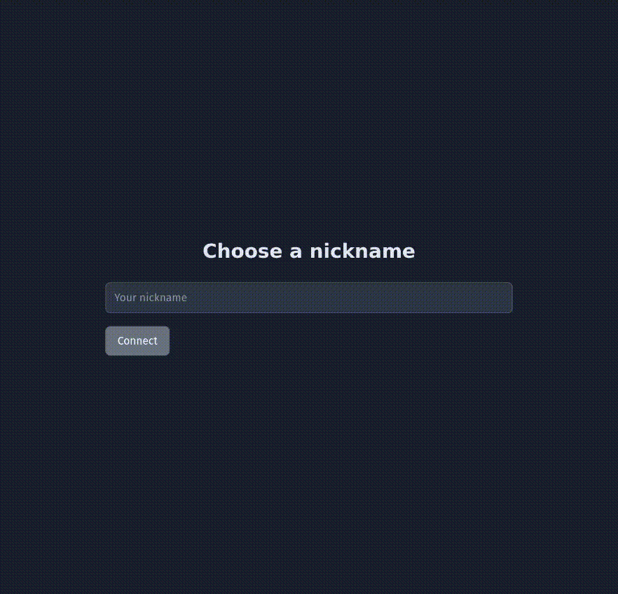

## About PubChat
Study project to explore and practice real-time communication using Spring Boot and WebSocket. The main goal was to learn the architecture behind a chat application, including the use of message brokers, dynamic topics, and basic state management.

As a study project, several simplifications were made, but the core concept was successfully implemented.

  

## Technologies
- Spring Web
- Spring WebSocket
- STOMP
- In-Memory Message Broker
- HTML, CSS e JavaScript for the basic frontend
- SockJS e Stomp.js

## Features
- Global chat: Upon connecting, the user joins a public room where all connected users can chat
- Private rooms: Users can generate a unique ID for a private room via a REST endpoint, allowing others to connect using that ID
- Room validation: The backend prevents users from joining rooms with arbitrary or invalid IDs
- 'User is typing' indicator in private rooms

## API and WebSocket routes

REST:

| Method | Route | Description |
| --- | --- | --- |
| POST | `/api/rooms` | Creates a private room |
| GET | `/api/rooms/{room}/available` | Checks whether a room exists |

WebSocket/STOMP:

| Type | Destination | Description |
| --- | --- | --- |
| connect | `/ws` | Opens the WebSocket/STOMP connection |
| send | `/app/chat/rooms/{roomId}/messages` | Sends a chat message |
| send | `/app/chat/rooms/{roomId}/typing` | Sends a typing event |
| subscribe | `/topic/rooms/{roomId}` | Receives room messages and events |

## Limitations
- In-memory room repository and in-memory message broker
- Private rooms are temporary and inactive rooms are cleaned up automatically
- No message persistence
- No spam protection (messages and room creation)
